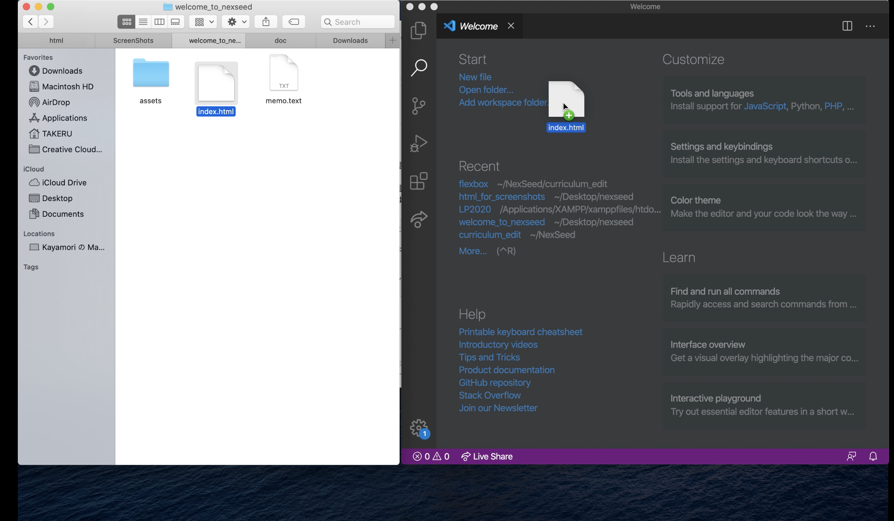
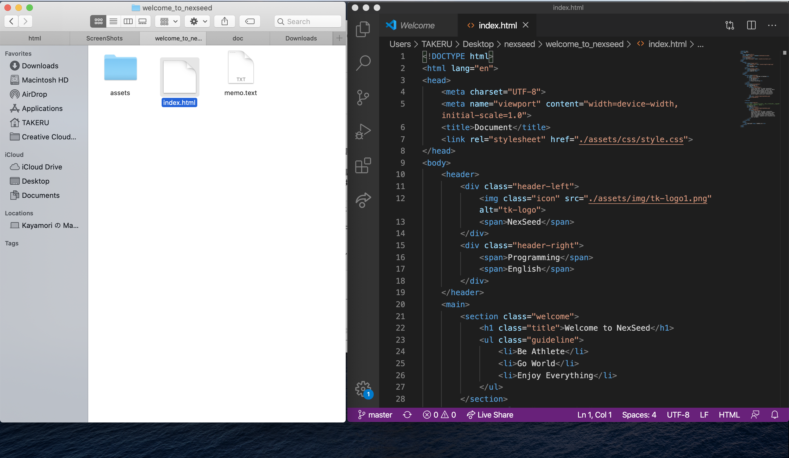
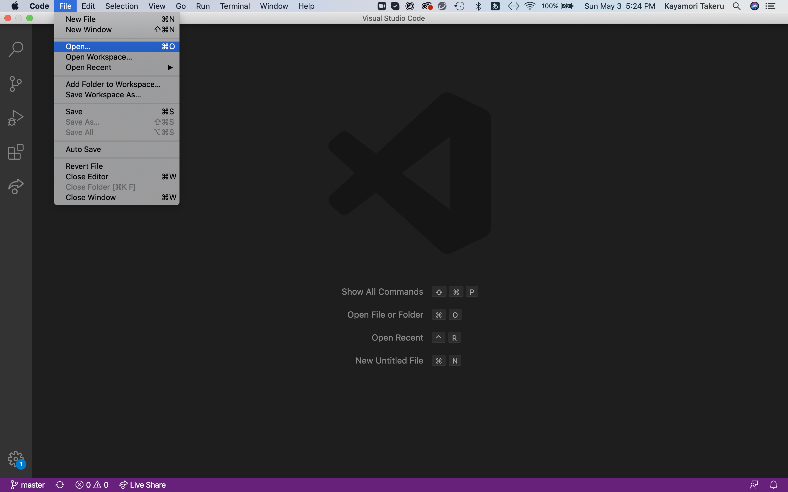
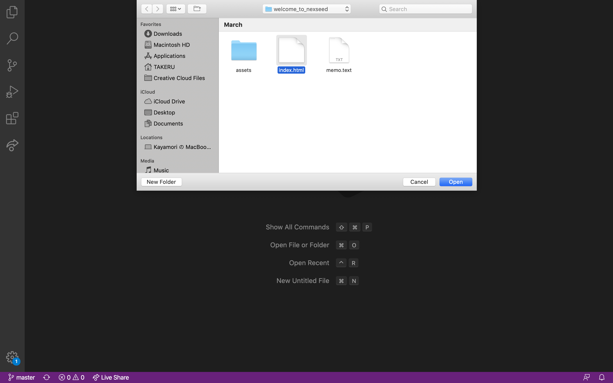
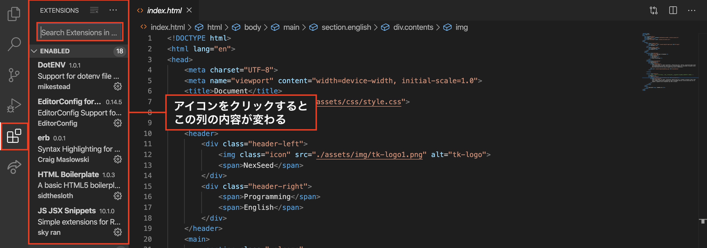
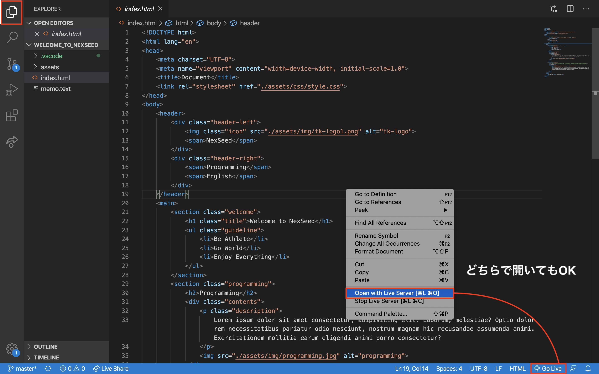

# VS Codeの使い方

VS Codeとは、テキストエディタと呼ばれる種類のツールで、プログラミングのコードを書いていく上で便利な機能が備わっています。
ここではVS Codeの以下の基本的な操作について解説します。
- ファイルの開き方
- 拡張機能のインストール
- ショートカット

## ファイルの開き方
ファイルの開き方には主に２種類の方法があります。
- ドラッグ＆ドロップ
- メニューバーから開く

### ドラッグ＆ドロップ
1. VS CodeとFinderを同時に開き、編集したいファイルをドラッグし、VS Codeのウィンドウ上の、どこでもいいのでドロップします。



2. ファイルが自動的に開かれます。




### メニューバーから開く

1. カーソルを画面の一番上に合わせると、以下のようなメニューバーが表示されます

2. File / Open...をクリックしてください。

3.  開きたいファイル、またはフォルダを選択して、Openをクリックします。

1. ファイルではなくディレクトリ(フォルダ)をドラッグ＆ドロップすると、左側にディレクトリ階層が表示されます。 プログラミングをする場合、一度に複数のファイルを使用することが多いため、 基本的にこちらの使い方をしましょう。
<br>左側に階層が表示されない場合は左上のアイコンをクリックしてください。


<br>
<br>
<br>

## 拡張機能のインストール

VS Codeには、便利な機能が元々たくさん備わっていますが、拡張機能を追加することで、自分の好みに合わせた環境にカスタマイズすることが可能です。ここでは、授業の中でも使う「Live Server」という拡張機能をインストールしてみましょう。

1. 左側にアイコンが５つ並んでいます。下から２番目のアイコンをクリック、検索バーを表示しましょう。

2. 1. 検索バーに「live server」と検索。
   2. 検索結果の一番上のものをクリック。
   3. 「Install」と書いてある緑色のボタンをクリックしましょう。

1. 左上のアイコンをクリックして、index.htmlファイルに戻りましょう。すると、画面一番下の青いバーに「Go Live」の文字が追加されているのでクリックするとHTMLファイルがGoogle Chrome上で開かれます。または、右クリックを押し、「Open with Live Server」をクリックでも同様の操作ができます。
<br>※「Go Live」もしくは「Open with Live Server」が表示されない場合は、VS Codeを再起動してみてください。



<br>
<br>
<br>

## ショートカット

### よく使うコマンド
|macOS|Windows|コマンド
|:---| :--- | :--- |
|Ctrl + C|Command + C|コピー|
|Ctrl + X|Command + X|切り取り|
|Ctrl + S|Command + S|保存|
|Ctrl + A|Command + A|全て選択|
|Ctrl + Z|Command + Z|取り消し|
|Ctrl + Y|Command + Shift + Z|取り消しの取り消し|
|Ctrl + D|Command + D|選択した部分と同じテキストを選択|
|Ctrl + F|Command + F|ファイル内の文字検索|
|Ctrl + N|Command + N|新しいファイルを作成|
|Ctrl + Shift + N|Command + Shift + N|新しいウィンドウを開く|
|Ctrl + →|Command + →|行の一番右へ移動|
|Ctrl + ←|Command + ←|行の一番左へ移動|
|Ctrl + Shift + →|Command + Shift + →|カーソル位置から行の一番右までを選択|
|Ctrl + Shift + ←|Command + Shift + ←|カーソル位置から行の一番左までを選択|
|Ctrl + Shift + ↑|Command + Shift + ↑|カーソル位置から一番上までを選択|
|Ctrl + Shift + ↓|Command + Shift + ↓|カーソル位置から一番下までを選択|
|Shift + ← or →|Shift + ← or →|カーソル位置から左右に移動した分だけ選択|
|Alt + ↑|Option + ↑|選択した範囲を上の行に移動|
|Alt + ↓|Option + ↓|選択した範囲を下の行に移動|

【Macをお使いの方】
ショートカットの説明で、```⌘, ⇧, ⌥, ⌃```の記号が出て来ることがしばしばあります。そんなに数は多くないので意味を覚えましょう。

|記号|意味|読み方|
|:---| :--- |:--- |
|⌘|Command | コマンド|
|⇧|Shift|シフト|
|⌥|Opstion|オプション|
|⌃|Control|コントロール|

### 参考URL
- [VS Code公式 / コマンド一覧 (Mac)](https://code.visualstudio.com/shortcuts/keyboard-shortcuts-macos.pdf)
- [VS Code公式 / コマンド一覧 (Windows)](https://code.visualstudio.com/shortcuts/keyboard-shortcuts-windows.pdf)
- [参考記事（日本語）](https://qiita.com/oruponu/items/ae9c720d4522c1606daf)

<!-- ### 一般
|macOS|Windows|コマンド
|:---| :--- | :--- |
|Ctrl+Shift+P, F1|⇧⌘P, F1|すべてのコマンドの表示|
|Ctrl+P|⌘P|クイックオープン|
|Ctrl+Shift+N|⇧⌘N|新しいウィンドウ|
|Ctrl+Shift+W|⌘W|ウィンドウを閉じる|
|Ctrl+K Ctrl+S|⌘K ⌘S|キーボード ショートカットを開く| -->

<!-- 
### 基本編集
|macOS|Windows|コマンド
|:---| :--- | :--- |
|Ctrl+X|⌘X|切り取り|
|Ctrl+C|⌘C|コピー|
|Alt+↓|⌥↓|行を下へ移動|
|Alt+↑|⌥↑|行を上へ移動|
|Shift+Alt+↓|⇧⌥↓|行を下へコピー|
|Shift+Alt+↑|⇧⌥↑|行を上へコピー|
|Ctrl+Shift+K|⇧⌘K|行の削除|
|Ctrl+Enter|⌘Enter|行を下に挿入|
|Ctrl+Shift+Enter|⇧⌘Enter|行を上に挿入|
|Ctrl+Shift+\|⇧⌘\|ブラケットへ移動|
|Ctrl+]|⌘]|行のインデント|
|Ctrl+[|⌘[|行のインデント解除|
|Ctrl+Home|⌘↑|先頭に移動|
|Ctrl+End|⌘↓|末尾に移動|
|Ctrl+/|⌘/|行コメントの切り替え|
|Shift+Alt+A|⇧⌥A|ブロック コメントの切り替え|
|Alt+Z|⌥Z|折り返しの切り替え|
 -->
