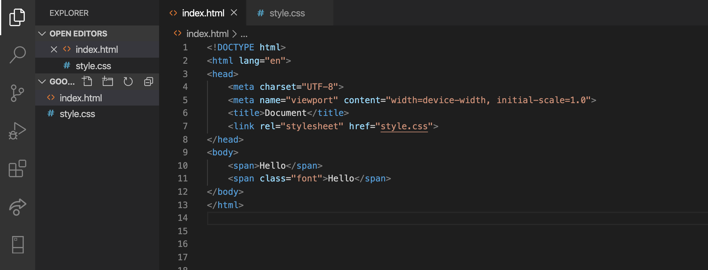
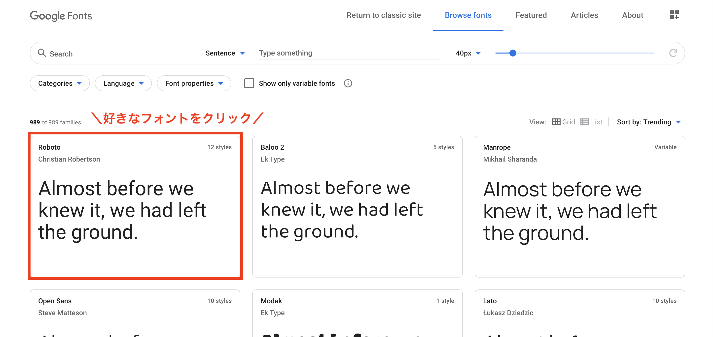
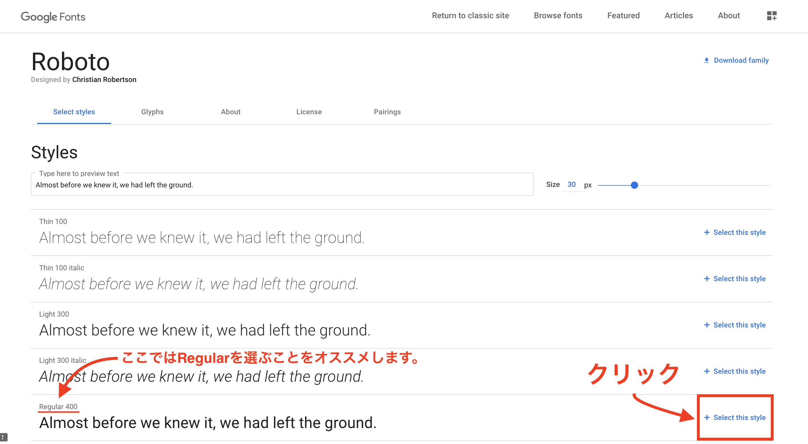
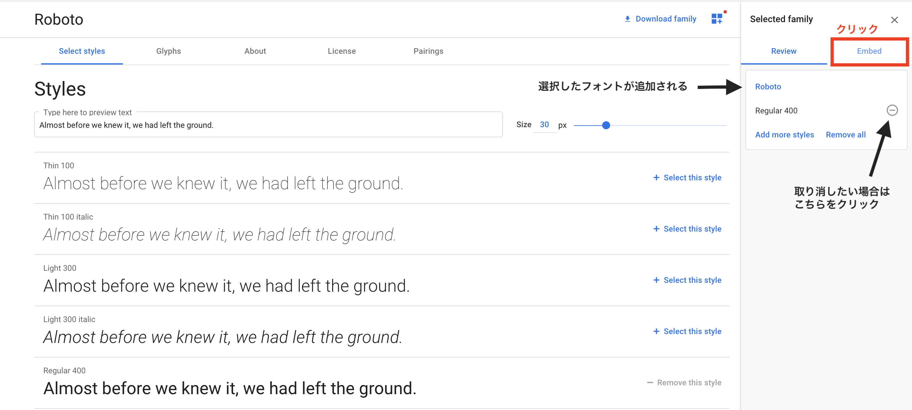

# Google Fontsの導入

ここでは、Google Fontsというサービスから好みのフォントを選び、自分のウェブサイトに導入する方法を解説します。


### 1. 準備

- 任意のフォルダ内に```index.html```と```style.css```を作成しましょう。
- ```<head>```の中に```<link rel="stylesheet" href="style.css">```と書いて、CSSファイルを読み込みます。
- フォントの違いを見比べるために、２つの```<span>```タグを書き、片方には```class="font"```と書きます。
<!-- prepare_files.png -->


### 2. Google Fontsで好きなフォントを選ぶ

[Google Fonts](https://fonts.google.com/)
<br>
上のリンクからGoogle Fontsを開き、好きなフォントをクリックしてください。
見本と同じフォントを選ぶ必要はありません。

<!-- google_fonts_top.png -->

### 3. フォントウェイト・スタイルを選ぶ

2で好きなフォントを選ぶと以下のようなページに飛び、フォントウエイトや、スタイルが選べます。ただし、これらはCSSで変えられるので、Regularを選択することをオススメします。各文字の一番右側にある「+ Select this style」をクリックしてください。
<!-- select_font_style.png -->


### 4. 選んだフォントの確認

すると右側にバーが現れるので、「Embed」の文字をクリックしましょう。
<!-- chosen_font.png -->

もし、誤ってバーを閉じてしまった場合は右上のアイコンをクリックすることでサイドバーを開けます。
<!-- open_sidebar.png -->


### 5. 必要な情報をコピー＆ペースト

- linkをコピーし、``index.html``の``<head>``の中に貼り付けます。
<!-- paste_link.png -->

- font-familyをコピーし、 ``style.css``で、セレクタを``.font``とした {} の中に貼り付けます。
<!-- paste_css.png -->


### 6. 確認
以下の画像のように、２個目の文字のフォントが変わっていれば成功です。
<!-- font_result.png -->


