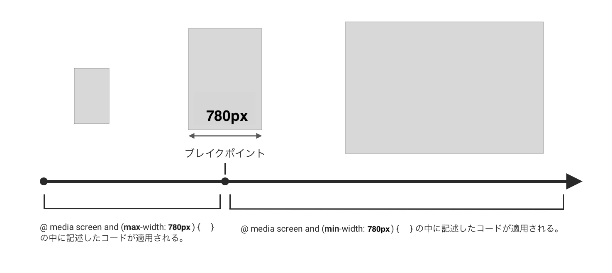
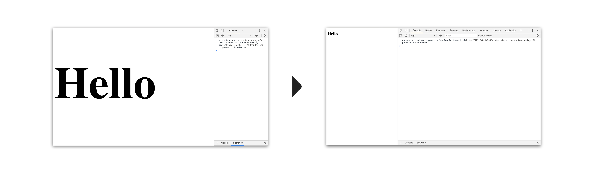

# レスポンシブ

1. 概要
2. メディアクエリの基本
3. モバイルファースト / デスクトップファースト
4. 実践

## 1. 概要

### レスポンシブとは

CSSのレスポンシブとは、パソコンやスマホ、タブレットなどの画面サイズの異なるデバイスでも、ユーザーが使いやすいように対応させることです。 


## 2. メディアクエリの基本
メディアクエリとは、指定した画面サイズの時にのみ使われるCSSの要素などを決めるものです。
実際のコードを見てましょう。
```css
h1 {
 font-size: 30px;
}
@media screen and (min-width:480px) { 
    h1 { 
        font-size: 300px;
    }
}
```
`@media　screen and (min-width:480px) { }`は、画面の横幅（width）が`480px`までは、以下のCSSを適用するという意味です。よって上記のコードでは、「画面の横幅が`480px`以上の時は`font-size`が`300px`、それ以外の場合は`300px`」ということになります。
また、ここでは`480px`を指定しましたが、この値のことを**ブレイクポイント**といいます。
ちなみに`min`は`minimum`の略で最小値という意味です。

下の図を参考に、頭の中を整理してみてください。




## 3. モバイルファースト / デスクトップファースト

上記の場合、フォントサイズは基本は`30px`で、画面の横幅が`480px`より大きい場合のフォントサイズを`300px`という条件を付けた書き方になっています。
これは、最初に小さい画面（スマホなど）を基準にしています。
このような書き方を**モバイルファースト**と言います。
逆に大きい画面を基準にした書き方は、**デスクトップファースト**と言います。この場合は`min-width`ではなく、`max-wdith`で指定します。

現在では、スマートフォンの普及によって、モバイル端末からのアクセスが多くなったことから、モバイルファーストで書くことが一般的になっています。

```css
h1 {
 font-size: 300px;
}
@media screen and (max-width:480px) { 
    h1 { 
        font-size: 30px;
    }
}
```
（画面が小さい時、30px）


## 4. 実践

説明で用いた、CSSのコードを記述すると次のような画面になります。
画面の幅を変えると、文字が500pxから30pxに変わることが確認できます。




解説は以上になります。
次は、自分で実際に書いてみましょう。

### 参考リンク

* [レスポンシブの基本、メディアクエリの書き方](https://sole-color-blog.com/blog/71/)